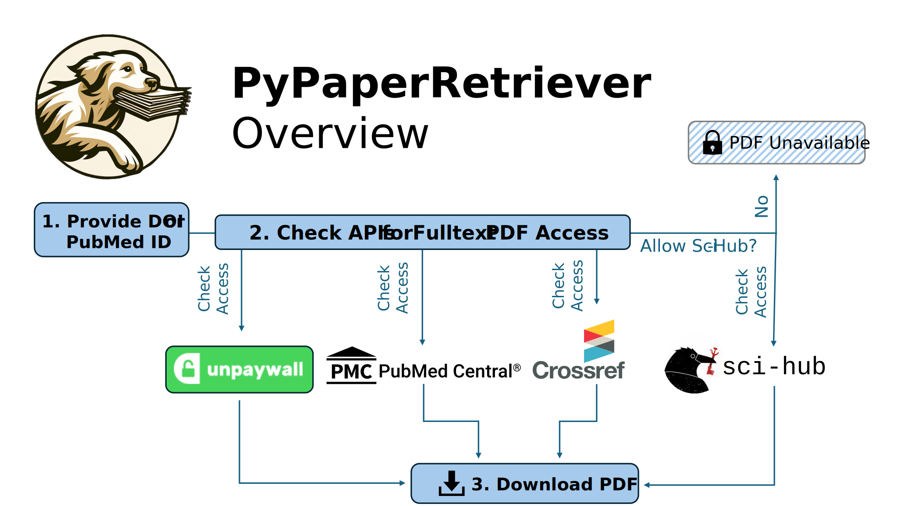

# PyPaperRetriever: A Python Tool for Finding and Downloading Scientific Literature
### **Authors: Joseph I Turner1, Kaydance D Turner2**
#### 1 Center for Brain Circuit Therapeutics, Harvard Medical School 
#### 2 Department of Computer Science, Brigham Young University

## Summary

PyPaperRetriever is a Python tool designed to simplify the process of finding and downloading scientific literature. For any given DOI or PubMed ID, PyPaperRetriever communicates with multiple APIs, including Unpaywall, NIH's Entrez, CrossRef, and Sci-Hub, to locate and download PDFs directly to the user's system. The tool is user-friendly, featuring a command-line interface and functionality that can be imported into Python scripts for integration with research workflows. PyPaperRetriever offers a significant advantage over other tools by leveraging multiple APIs to ensure broad coverage, prioritizing open-access sources, and enabling PubMed ID-based searches. Additionally, PyPaperRetriever allows users to programmatically search PubMed with custom queries and download PDFs of search results, making it an essential resource for researchers conducting literature reviews or managing large datasets.

### Core Features

**1. Find and Download PDFs for a Given DOI or PubMed ID:** PyPaperRetriever can find and download PDFs for a given DOI or PubMed ID by querying multiple APIs, including Unpaywall, NIH's Entrez, CrossRef, and Sci-Hub. If a PDF is found, PyPaperRetriever will download it to the user's system. Sci-Hub is used as a last resort due to its controversial nature, and users can easily disable this feature if desired.

**2. Search PubMed programatically:** PyPaperRetriever can search PubMed using a query string and download PDFs of the search results. This feature is useful for researchers who want to download multiple papers based on a specific topic or keyword.

**3. Extract figures/images from PDFs:** PyPaperRetriever can extract figures and images from PDFs and save them as PNG files. This feature is useful for researchers who want to extract and analyze figures or images from scientific papers, and is robust to a variety of PDF formats. PyPaperRetriever has been used to build an extensive catalog of brain lesion images for training computer vision models.

**4. Finding references, and building citation networks:** PyPaperRetriever allows users to track a paper's citation network using a DOI or PubMedID. It finds papers that reference the given paper, as well as the papers it references. This process can be repeated recursively to any desired depth, enabling users to explore how the paper has influenced others and the foundational work it is built upon across multiple generations of citations.

## Statement of Need
Efficient access to scientific literature is critical for researchers, yet manually locating and downloading PDFs is often tedious and time-consuming1,2. PyPaperRetriever automates this process, enabling researchers to quickly find and download papers from a variety of sources. The tool has been extensively used in research projects, including aggregating over 7,000 brain lesion case reports for LesionBank.org and supporting several thousand additional downloads for other miscellaneous projects. By streamlining literature retrieval and integrating advanced search capabilities, PyPaperRetriever addresses a need in the research community, offering a practical, time-saving solution for projects requiring comprehensive literature aggregation. This workflow is easily integrated into CADIMA pipelines, where it has been successfully used to streamline data collection and analysis.

Furthermore, the ability to leverage Large Language Models (LLMs) for screening full text, extracting detailed insights, and mining not only abstracts but also full-text content, figures, and images represents a critical goal for the next generation of AI tools in scientific literature3,4. PyPaperRetriever provides the foundational infrastructure necessary to facilitate these advancements, ensuring researchers are equipped to harness the full potential of AI-driven literature analysis.

## Methods

PyPaperRetriever is a Python-based tool designed to search, retrieve, and analyze scientific papers using a structured, object-oriented approach. The primary class, PaperRetriever, serves as the central interface and can be used both via the command line and as an importable module for integration into custom Python scripts or Jupyter notebooks. Supporting classes—PubMedSearcher, ImageExtractor, PaperTracker, and ReferenceRetriever—extend its capabilities, allowing for enhanced paper searching, citation tracking, and figure extraction.

### Object-Oriented Structure

The software is structured around the following classes:
- **`PaperRetriever`:** The core class responsible for retrieving scientific papers. It supports searching for papers using DOIs or PubMed IDs and attempts to download them using multiple external sources. This class is importable from the PyPaperRetriever module and can also be executed via the command line.
- **`PubMedSearcher`:** Facilitates keyword-based searching of PubMed, retrieving metadata, and assembling structured datasets of search results.
- **`ImageExtractor`:** Extracts images and figures from downloaded PDFs, handling both native and image-based PDFs.
- **`ReferenceRetriever`**: Gathers references and citations for a given paper using multiple external APIs.
- **`PaperTracker`:** Builds citation networks by tracing references upstream (papers cited by the target paper) and downstream (papers that cite the target paper), storing results in structured DataFrames.

### Command-Line vs. Programmatic Usage

- **Command-Line Interface (CLI)**: The PaperRetriever class can be executed directly from the command line using the main() function, allowing users to quickly retrieve papers without writing additional code. Sci-Hub can be explicitly enabled or disabled via the command line.

- **Python Module Import**: While PaperRetriever can be used standalone, the supporting classes (PubMedSearcher, ImageExtractor, PaperTracker, and ReferenceRetriever) are intended for use in Python scripts and Jupyter notebooks, providing more flexibility for data analysis and automation.

### Dependencies
#### APIs
- **Unpaywall:** Provides open-access PDFs for articles identified by DOIs.
Serves as the primary source for PDFs due to its reliability and broad coverage of open-access articles.
- **NIH's Entrez:** Enables PubMed searches and access to article metadata.
Used for tasks such as converting PubMed IDs to DOIs, identifying freely available articles in PubMed Central, and retrieving references for building citation networks.
- **CrossRef:** Supplies metadata for DOIs, including reference lists.
Used as an alternative source for full-text PDFs when Unpaywall does not return results. It tends to work well for newer articles but has a lower overall success rate compared to Unpaywall.
- **Sci-Hub:** Used as a backup source for PDFs when other APIs do not provide results.
Can be disabled if preferred. It is included to ensure access to papers that may be behind paywalls.

#### Python Libraries

- **BioPython:** Interfaces with the Entrez API for PubMed searches and metadata retrieval.
- **requests:** Handles HTTP requests to interact with the APIs.
- **PyMuPDF (fitz):** Extracts figures and images from PDFs in various formats.
- **pdf2image:** Converts PDFs to image files to support figure extraction.
- **lxml:** Parses XML responses from the Entrez API.
- **pandas:** Facilitates data manipulation and storage for citation networks and search results.
- **numpy:** Provides tools for data validation during figure extraction.
- **tqdm:** Adds progress bars for bulk downloads and searches.
- **setuptools:** Used for packaging and distribution.

## Similar Tools
Several tools exist for finding and downloading scientific literature, but PyPaperRetriever stands out due to its versatility and robust integration with multiple APIs. Here, we compare PyPaperRetriever with similar tools to highlight its advantages:

**1. PyPaperBot**

PyPaperBot, while functional, has significant limitations that prompted the development of PyPaperRetriever. PyPaperBot relies exclusively on Sci-Hub, which is ethically controversial and often blocked by academic institutions and in certain countries. Additionally, it lacks support for PubMed ID-based searches, a critical feature for researchers in biomedical sciences. PyPaperRetriever addresses these shortcomings by:

- Integrating with three different APIs (Unpaywall, NIH's Entrez, and CrossRef) to expand access to a wide range of sources.
- Prioritizing open-access sources before resorting to Sci-Hub, aligning with ethical research practices.
- Utilizing multiple Sci-Hub mirrors and robust text-scraping techniques to improve reliability when Sci-Hub is necessary.
- Supporting PubMed ID searches and programmatic PubMed queries.
- Enabling module-level imports for integration into Python workflows, unlike PyPaperBot’s command-line-only functionality.

**2. Proprietary Software (e.g., DistillerSR, Convidence)**

There are several proprietary software tools for managing scientific literature, but they often come with high costs and limited flexibility. PyPaperRetriever offers a free, open-source alternative with comparable functionality. Additionally, PyPaperRetriever's modular design allows users to customize and extend its capabilities, making it a versatile and cost-effective solution for researchers.

## Availability

All code and documentation for PyPaperRetriever are available on [GitHub](https://github.com/JosephIsaacTurner/pypaperretriever). The tool is distributed under the MIT License, allowing for free use, modification, and redistribution. Instructions for installation and usage are provided in the README file.

## Author Contributions
JIT conceived the idea for PyPaperRetriever, developed the codebase, and wrote documentation. JIT is the primary author of this paper and takes full responsibility for the content. KDT also provided feedback on the tool's design and functionality, contributed to the documentation, and assisted in testing and debugging.

## References

1. Zhang M, Doi L, Awua J, Asare H, Stenhouse R. Challenges and possible solutions for accessing scholarly literature among medical and nursing professionals and students in low-and-middle income countries: A systematic review. Nurse Educ Today. 2023;123:105737. doi:10.1016/j.nedt.2023.105737
2. Singh A, Singh M, Singh AK, Singh D, Singh P, Sharma A. "Free full text articles": where to search for them?. Int J Trichology. 2011;3(2):75-79. doi:10.4103/0974-7753.90803
3. Oami T, Okada Y, Nakada TA. Performance of a Large Language Model in Screening Citations. JAMA Netw Open. 2024;7(7):e2420496. Published 2024 Jul 1. doi:10.1001/jamanetworkopen.2024.20496
4. Scherbakov D, Hubig N, Jansari V, Bakumenko A, Lenert LA. The emergence of Large Language Models (LLM) as a tool in literature reviews: an LLM automated systematic review. arXiv. Preprint. Published September 6, 2024. doi:10.48550/arXiv.2409.04600.