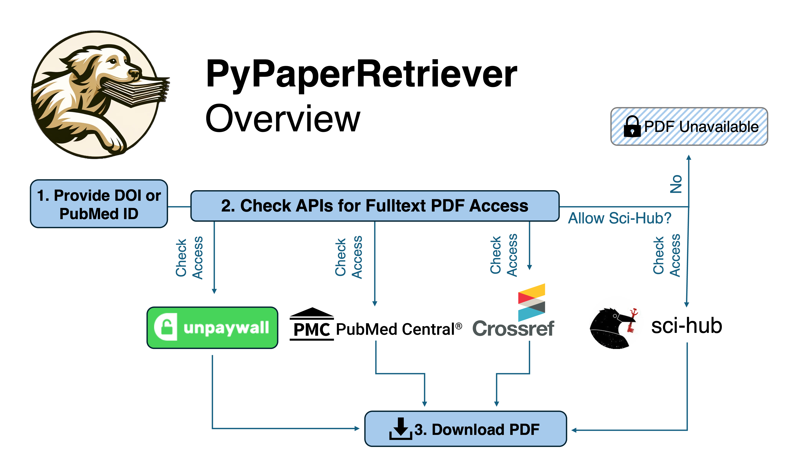
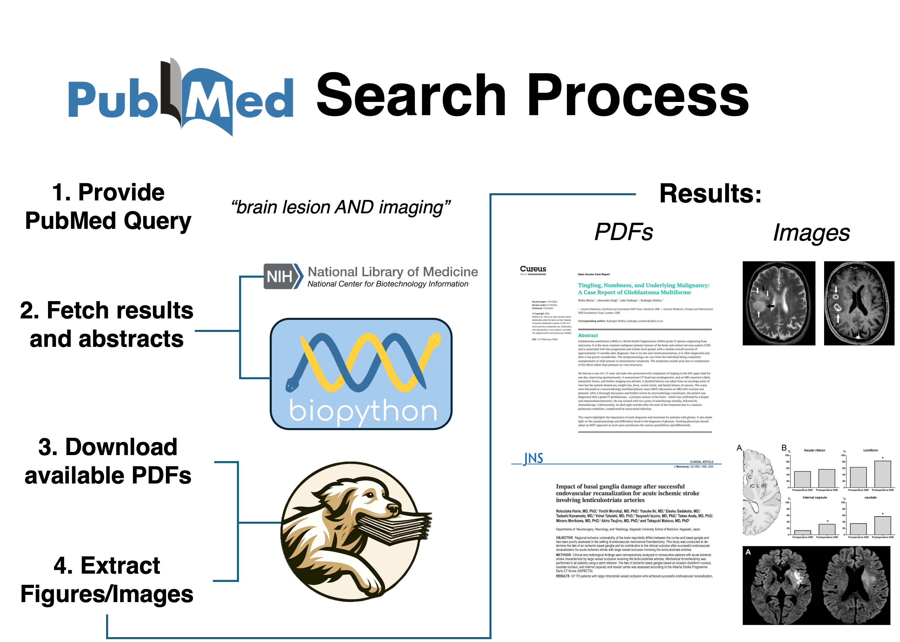

# Summary

PyPaperRetriever is a Python tool that automates the discovery and retrieval of scientific literature, starting from either a DOI or PubMed ID. It queries multiple sources—Unpaywall, NIH Entrez/PMC, CrossRef, and optionally Sci-Hub—to locate and download PDFs, prioritizing open access. The tool supports programmatic PubMed searches with custom queries, enabling bulk PDF downloads, metadata resolution, and optional figure extraction in a single, reproducible workflow. Usable via command line or as a Python module, PyPaperRetriever provides a scalable, PubMed-first solution for literature reviews, dataset creation, and other projects requiring comprehensive literature aggregation.

### Core Features

**1. Find and Download PDFs for a Given DOI or PubMed ID:** PyPaperRetriever can find and download PDFs for a given DOI or PubMed ID by querying multiple APIs, including Unpaywall, NIH's Entrez, CrossRef, and Sci-Hub. If a PDF is found, PyPaperRetriever will download it to the user's system. Sci-Hub is used as a last resort due to its controversial nature, and users can easily disable this feature if desired.

**2. Search PubMed programatically:** PyPaperRetriever can search PubMed using a query string and download PDFs of the search results. This feature is useful for researchers who want to download multiple papers based on a specific topic or keyword.

**3. Extract figures/images from PDFs:** PyPaperRetriever can extract figures and images from PDFs and save them as PNG files. This feature is useful for researchers who want to extract and analyze figures or images from scientific papers, and is robust to a variety of PDF formats. PyPaperRetriever has been used to build an extensive catalog of brain lesion images for training computer vision models.

**4. Finding references, and building citation networks:** PyPaperRetriever allows users to track a paper's citation network using a DOI or PubMedID. It finds papers that reference the given paper, as well as the papers it references. This process can be repeated recursively to any desired depth, enabling users to explore how the paper has influenced others and the foundational work it is built upon across multiple generations of citations.

# Statement of Need

Efficient, reproducible access to full texts at scale remains a bottleneck for systematic reviews, dataset construction, and downstream AI/LLM workflows. Manually locating and downloading PDFs is tedious and time-consuming[@Zhang:2023; @Singh:2011], even with recent advances in open access (OA) and indexes like Unpaywall. Biomedical researchers often begin with PubMed queries rather than DOI lists, and converting those results into full-text PDFs involves several steps: resolving metadata from search results, handling newly posted green OA, validating links, and downloading large batches reliably. Without a dedicated tool, most labs resort to ad-hoc glue code and custom scripts that are hard to maintain.

PyPaperRetriever automates this process. It provides a PubMed-first, end-to-end pipeline that:
(i) executes complex PubMed searches;
(ii) resolves and downloads full text from multiple sources (prioritizing OA, with optional Sci-Hub fallback);
(iii) supports downstream analyses such as figure extraction and citation graphs; and
(iv) integrates cleanly into Python workflows.

The tool has been extensively used in research, including aggregation of over 7,000 brain lesion case reports for LesionBank.org and several thousand additional downloads for related neuroscience projects. By streamlining literature retrieval and integrating advanced search capabilities, PyPaperRetriever saves substantial time in projects requiring comprehensive literature aggregation, and it has been successfully embedded into PRISMA pipelines for systematic review workflows.

Looking ahead, the ability to leverage Large Language Models (LLMs) for screening full text, extracting detailed insights, and mining not only abstracts but also full-text content, figures, and images represents a critical step for the next generation of AI-driven literature tools[@Oami:2024; @Scherbakov:2024]. PyPaperRetriever provides the foundational infrastructure for these advancements, ensuring researchers can access and process the literature at scale.

# Methods

PyPaperRetriever is a Python-based tool designed to search, retrieve, and analyze scientific papers using a structured, object-oriented approach. The primary class, PaperRetriever, serves as the central interface and can be used both via the command line and as an importable module for integration into custom Python scripts or Jupyter notebooks. Supporting classes—PubMedSearcher, ImageExtractor, PaperTracker, and ReferenceRetriever—extend its capabilities, allowing for enhanced paper searching, citation tracking, and figure extraction.

### Object-Oriented Structure

The software is structured around the following classes:

- **`PaperRetriever`:** The core class responsible for retrieving scientific papers. It supports searching for papers using DOIs or PubMed IDs and attempts to download them using multiple external sources. This class is importable from the PyPaperRetriever module and can also be executed via the command line.
- **`PubMedSearcher`:** Facilitates keyword-based searching of PubMed, retrieving metadata, and assembling structured datasets of search results.
- **`ImageExtractor`:** Extracts images and figures from downloaded PDFs, handling both native and image-based PDFs.
- **`ReferenceRetriever`**: Gathers references and citations for a given paper using multiple external APIs.
- **`PaperTracker`:** Builds citation networks by tracing references upstream (papers cited by the target paper) and downstream (papers that cite the target paper), storing results in structured DataFrames.

### Command-Line vs. Programmatic Usage

- **Command-Line Interface (CLI)**: The PaperRetriever class can be executed directly from the command line using the main() function, allowing users to quickly retrieve papers without writing additional code. Sci-Hub can be explicitly enabled or disabled via the command line.

- **Python Module Import**: While PaperRetriever can be used standalone, the supporting classes (PubMedSearcher, ImageExtractor, PaperTracker, and ReferenceRetriever) are intended for use in Python scripts and Jupyter notebooks, providing more flexibility for data analysis and automation.

# Similar Tools
Several tools exist for finding and downloading scientific literature, but PyPaperRetriever stands out due to its versatility and robust integration with multiple APIs. Here, we compare PyPaperRetriever with similar tools to highlight its advantages:

**1. Unpaywall**

Unpaywall is a widely used open-access index for DOIs, offering a REST API that identifies locations of freely available PDFs on the web. It’s integrated into many reference managers and academic tools, and even has an R client for programmatic access. While Unpaywall is excellent for finding OA versions of papers, it is DOI-centric and does not support PubMed ID–based searches; nor does it provide a complete end-to-end solution for downloading PDFs at scale.

PyPaperRetriever builds on Unpaywall by handling the entire workflow, from running PubMed searches, to resolving mixed PMID/DOI metadata, to downloading PDFs, and optionally extracting images. In practice, we’ve found that Unpaywall’s API can occasionally miss newly deposited green OA copies or point to PDFs that are hosted in ways that block automated retrieval. PyPaperRetriever addresses these gaps by also querying NIH’s Entrez (PubMed/PMC) and CrossRef, and by offering Sci-Hub as a last-resort fallback. This multi-source approach improves reliability and coverage, ensuring that even papers outside Unpaywall’s current index can be found and downloaded.

**2. PyPaperBot**

PyPaperBot [@pypaperbot], while functional, has significant limitations that prompted the development of PyPaperRetriever. PyPaperBot relies exclusively on Sci-Hub, which is ethically controversial and often blocked by academic institutions and in certain countries. Additionally, it lacks support for PubMed ID-based searches, a critical feature for researchers in biomedical sciences.

PyPaperRetriever addresses these shortcomings through several key improvements. It integrates with three different APIs (Unpaywall, NIH's Entrez, and CrossRef) to expand access to a wide range of sources, and prioritizes open-access sources before resorting to Sci-Hub. When Sci-Hub is necessary, it employs multiple mirrors and robust text-scraping techniques for improved reliability. The tool also supports PubMed ID searches and programmatic PubMed queries, while enabling module-level imports for integration into Python workflows, unlike PyPaperBot's command-line-only functionality.

**3. Proprietary Software**

There are several proprietary software tools for managing scientific literature, including DistillerSR and Convidence. These often come with high costs and limited flexibility. PyPaperRetriever offers a free, open-source alternative with comparable functionality.

# Ethical and legal note on Sci-Hub

Use of Sci-Hub is disabled by default and clearly labeled. Institutions and researchers differ in policy and legal context; PyPaperRetriever exposes an opt-in flag so users can comply with local rules while retaining a complete pipeline for contexts where such access is permitted. The authors of PyPaperRetriever do not endorse or encourage the use of Sci-Hub in violation of local laws or institutional policies. Users are responsible for ensuring compliance with all applicable laws and ethical guidelines when using this tool.

# Availability

All code and documentation for PyPaperRetriever are available on [GitHub](https://github.com/JosephIsaacTurner/pypaperretriever). The tool is distributed under the MIT License, allowing for free use, modification, and redistribution. Instructions for installation and usage are provided in the README file. We welcome contributions and feedback from the community to improve the tool and expand its capabilities. Opening an issue on the GitHub repository is the best way to report bugs or request features; pull requests are also welcome for contributions and will be reviewed promptly.

# Acknowledgements

JIT conceived the idea for PyPaperRetriever, developed the codebase, and wrote documentation. JIT is the primary author of this paper and takes full responsibility for the content. KDT also provided feedback on the tool's design and functionality, contributed to the documentation, and assisted in testing and debugging.

# References